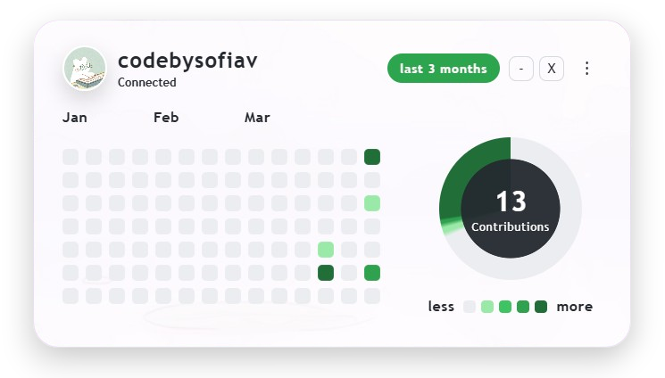
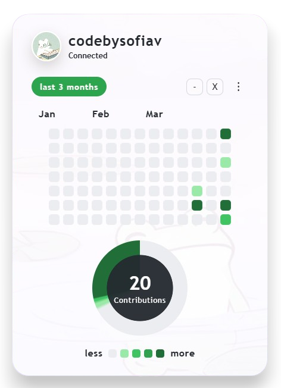
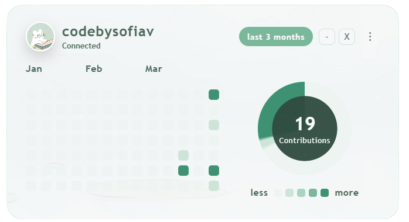
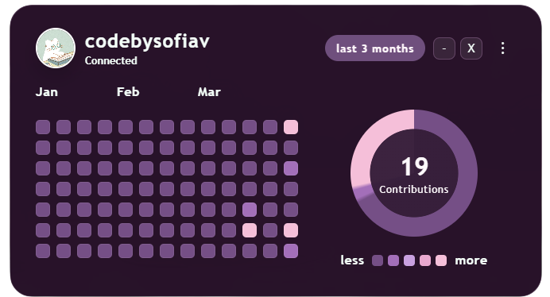
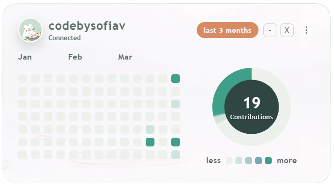
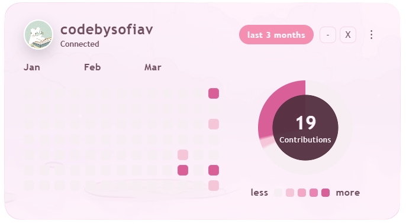

# GitHub Widget

Widget local de escritorio hecho con Electron para visualizar contribuciones de GitHub, cambiar tema, ajustar tamano del widget y guardar la sesion local del usuario.

## Preview
<p align="center">
  
  
</p>

## Caracteristicas

- Login local con `GitHub username` y `Personal access token`
- Persistencia local con `localStorage`
- Carga de perfil y contribuciones desde la API de GitHub
- Avatar dinamico en el header
- Logout desde el menu
- Cambio de orientación: horizontal o vertical
- Cambio de tema
- Cambio de tamano del widget
- Ventana tipo widget movible, minimizable y cerrable

## Tecnologias

- HTML
- CSS
- JavaScript
- Electron

## Configuración
Para usar el widget se necesita:
- Github username
- Github personal access token
Se puede generar el token aqui: https://github.com/settings/tokens

## Ejecutar en local

1. Instala dependencias:

```bash
npm install
```

2. Inicia la app:

```bash
npm start
```

## Empaquetar para Windows

1. Instala dependencias:

```bash
npm install
```

2. Genera una version empaquetada sin instalador:

```bash
npm run pack
```

3. Genera el instalador para Windows:

```bash
npm run dist
```

Los archivos generados quedaran en la carpeta `release/`.

## Como funciona el login

La app guarda estos datos en `localStorage` del entorno local de Electron:

- `github_user`
- `github_token`
- `theme`
- `widget_size`

Cuando la app vuelve a abrirse, reutiliza `github_user` y `github_token` para conectarse automaticamente.

## Estructura principal

- `index.html`: estructura del widget
- `script.js`: logica del widget, login, menu y carga desde GitHub
- `main.js`: ventana principal de Electron
- `preload.js`: puente seguro entre Electron y el frontend
- `css/`: estilos del widget y temas
- `img/`: imagenes del widget
- `assets/icono.ico`: icono de la app

## Themes
El widget soporta multiples temas, algunos de ellos son:
 - Github
 - Cream
 - Lavander
 - Matcha

 Más temas pueden ser añadidos facilmente en `styles_themes.css`.

<p align="center">
  
  
</p>

<p align="center">
  
  
</p>
